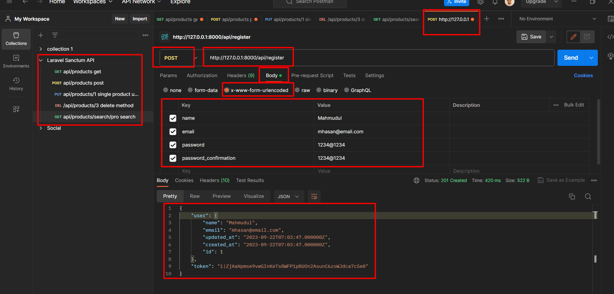
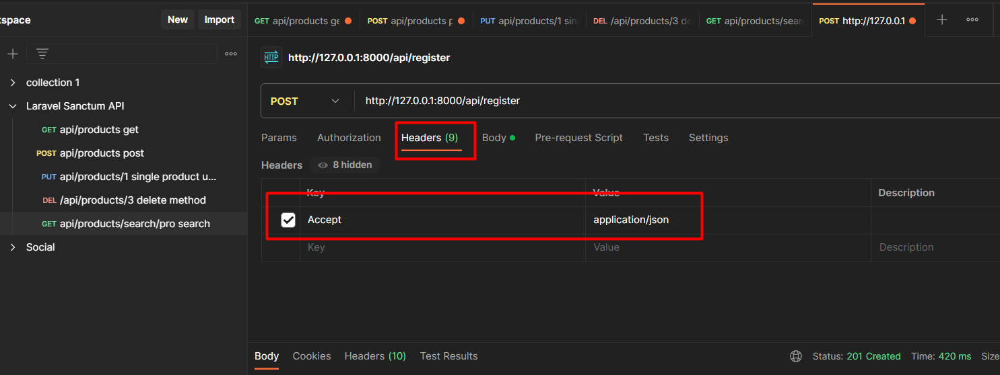
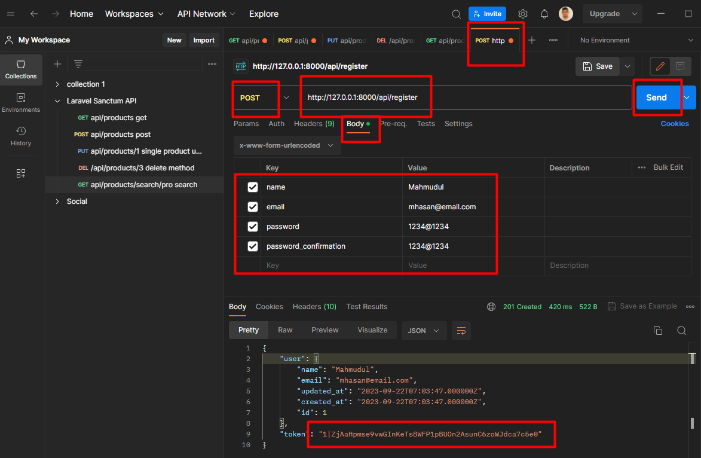
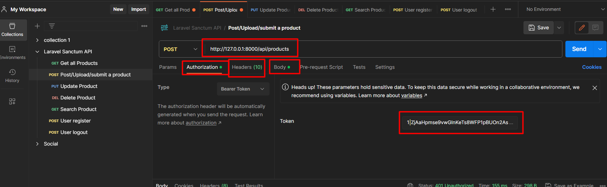
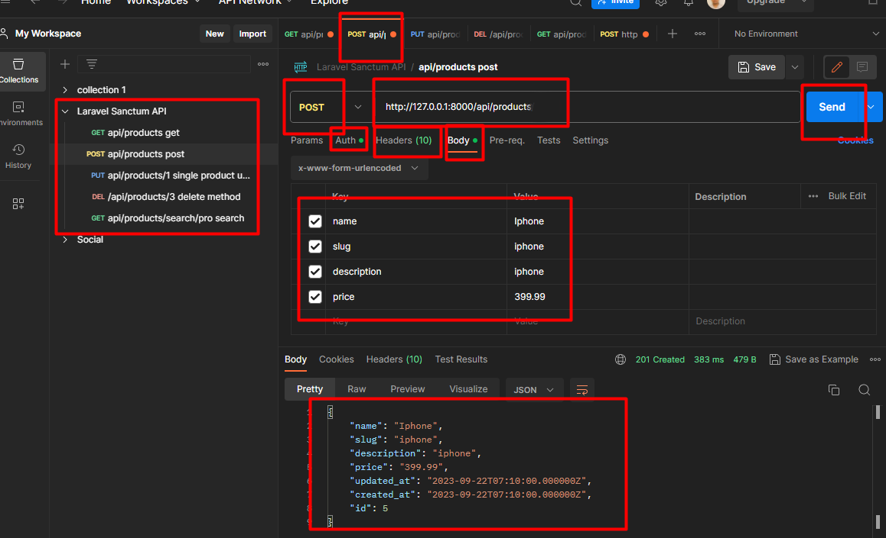
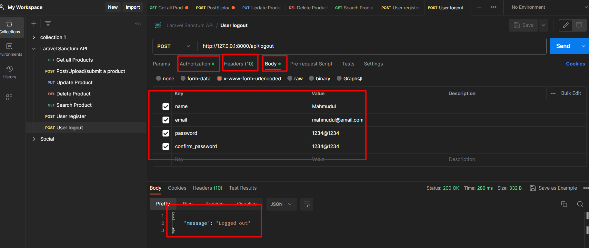

## Create Products API

We're working API making here

1. Use sqlite, so `.env` config will be for database be like

```env

DB_CONNECTION=sqlite
DB_HOST=127.0.0.1
DB_PORT=3306
```
2. And in **📂database** folder there have a `database.sqlite` file for database, and for database console we use [SQLite browser app for windows](https://sqlitebrowser.org/dl/)

3. As we make API, so our route file for API is `route > api.php`

4. We use `postman` for API test

## Test Initial API 

1. We make a API function in `routes > api.php` file. which return a string

```php

Route::get('/products', function(){
    return 'products';
});
```

2. And in Postman app we fetch or get this API and return string

`http://127.0.0.1:8000/api/products`

## Make API for Products 

1. Create Model for product with migration `php artisan make:model Product --migration`
2. At our product migration file (database > migrations > Products Table) we add column values 

```php

public function up(): void
{
    Schema::create('products', function (Blueprint $table) {
        $table->id();
        $table->string('name');
        $table->string('slug');
        $table->string('description')->nullable();
        $table->decimal('price', 5, 2);
        $table->timestamps();
    });
}
```
3. The make migrate `php artisan migrate`
4. Create a post route
5. Create a Controller `php artisan make:controller ProductController --api`
6. We create 
    - product controller `index, store, show, update, destroy, search` function
    - Products routes methods
    - Product Model `protected $fillable` objects
    - migration tables
7. By creating these we can make available api for 
    - show products `http://127.0.0.1:8000/api/products`
    - Store products `http://127.0.0.1:8000/api/products`
    - Update single products `http://127.0.0.1:8000/api/products/1`
    - Delete single products `http://127.0.0.1:8000/api/products/1`
    - Search products `http://127.0.0.1:8000/api/products/search/name`

## Laravel Sanctum

1. On the latest version of Laravel, sanctum is pre-installed
2. For authenticate a SPA, it should add Sanctum's middleware to api middleware group in `app/Http/Kernel.php` file, in latest version of Laravel it is already added, just uncomment the file.

```php

'api' => [
    \Laravel\Sanctum\Http\Middleware\EnsureFrontendRequestsAreStateful::class,
    \Illuminate\Routing\Middleware\ThrottleRequests::class.':api',
    \Illuminate\Routing\Middleware\SubstituteBindings::class,
],
```
3. To begin issuing tokens for users, `User model` should use the `Laravel\Sanctum\HasApiTokens` trait in `app/models/user.php`
4. Create route middleware for protected auth route, from
```php 
Route::get('/products/search/{name}', [ProductController::class, 'search']);
```

to

```php

Route::group(['middleware' => ['auth:sanctum']], function(){
    Route::get('/products/search/{name}', [ProductController::class, 'search']);
});
```
8. So we have now public and protected routes 

```php

// Public get Routes, show & search products and id
Route::get('/products', [ProductController::class, 'index']);
Route::get('/products/{id}', [ProductController::class, 'show']);
Route::get('/products/search/{name}', [ProductController::class, 'search']);


// Route for search a product name with Laravel Sanctum protected route auth
Route::group(['middleware' => ['auth:sanctum']], function(){
    Route::post('/products', [ProductController::class, 'store']);
    Route::put('/products/{id}', [ProductController::class, 'update']);
    Route::delete('/products/{id}', [ProductController::class, 'destroy']);
});
```
9. Create a Auth controller, `php artisan make:controller AuthController` 
10. Then we can register auth controller 

```php

// Register auth Controller
Route::get('/register', [AuthController::class, 'register']);
```
11. If controller and route is perfect then we can register a user by Postman and get response like this
. If error shown, then also check Postman header parameter 


12. Now we can register a user, and get a token


13. After that, we can now register a product by our authenticate user, but before that we need to authorize the user token in postman

    * 
    * 

14. Now create a logout AuthController function & Protected auth route

```php

public function logout(Request $request)
{
    auth()->user()->tokens()->delete();

    return [
        'message' => 'Logged out'
    ];
}
```

```php

Route::post('/logout', [AuthController::class, 'logout']);
```

15. If Authorization token, header & Body is perfectly give then we get logout response



16. Now create a login AuthController function & Protected auth route

